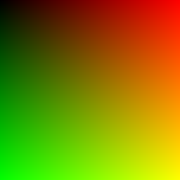

# RayTracer

This project is part of my master's thesis and is based on *Ray Tracing in One Weekend* by Peter Shirley.  
The goal is to implement a simple ray tracer in C++ from scratch and gradually extend it with new features.

At the current stage, the program generates a basic color gradient and writes it into a `.ppm` image file.  
Using **ImageMagick**, the `.ppm` file was converted to `.png` for easier viewing.

## Example output


*Figure 1 – first rendered image, converted from PPM to PNG using ImageMagick.*

## Build & Run

```bash
cmake -S . -B build -DCMAKE_BUILD_TYPE=Release
cmake --build build
build/RayTracer.exe > output/image.ppm
